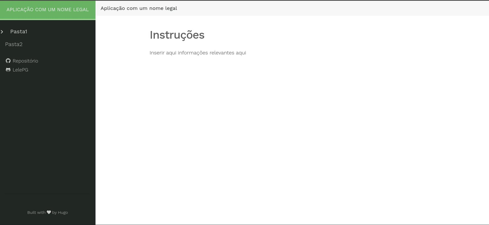

## 🤔 O que é este projeto?

Este projeto é um modelo de aplicação de apoio para ser utilizado nas minhas oficinas de programação e facilitar o desenvolvimento da oficina.

O projeto foi desenvolvido usando o gerador de site estático [Hugo](https://gohugo.io/) e o tema [Relearn](https://themes.gohugo.io/themes/hugo-theme-relearn/).

## 🤔 Como rodar o projeto?

Para rodar o projeto, basta fazer o download do repositório e rodar o comando `hugo server`, o que iniciará o servidor de desenvolvimento.

## 🤔 Como personalizar o projeto?

### Arquivo de configuração

No arquivo [config.toml](./config.toml) existem várias configurações que podem ser alteradas para modificar o site. Algumas dessas configurações são padrão do Hugo, mas outras são específicas do tema e podem ser consultadas [clicando aqui](https://mcshelby.github.io/hugo-theme-relearn/basics/customization/index.html)

### Editando layouts

Para sobrescrever um arquivo de layout definido pelo tema, é possível copiar esse arquivo da pasta layouts do repositório do tema para a pasta layouts desse repositório, já que o Hugo dará prioridade para os documentos dessa pasta. Mais informações sobre os arquivos de condiguração do tema podem ser acessados [clicando aqui](https://mcshelby.github.io/hugo-theme-relearn/basics/customization/index.html)

**Obs:** O caminho relativo à pasta layouts do repositório do tema deve ser replicado nesse repositório.

### Criando conteúdo

Para criar conteudo basta rodar o comando `hugo new` e o nome do arquivo que pode ser um arquivo `.html` ou `.md` como nos exemplos abaixo:

```
hugo new pagina1.md
hugo new pasta1/_index.md
hugo new pasta2/documento.md
hugo new pasta2/app.html
```

**Obs:** As configurações iniciais da página são definidas pelos arquivos definidos em archetypes.

## Links úteis

-   [Hugo](https://gohugo.io/)
-   [Relearn](https://themes.gohugo.io/themes/hugo-theme-relearn/)
